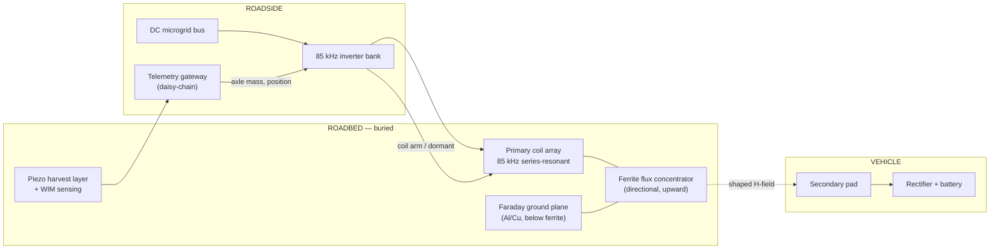
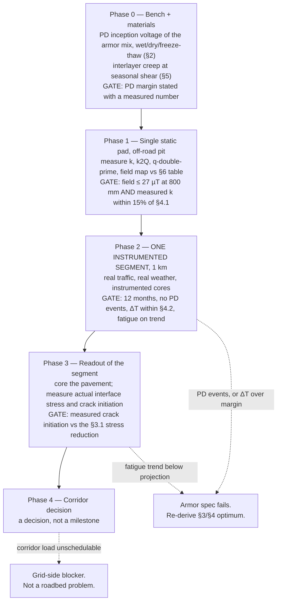

# ARK Lane — Dynamic Wireless Power Transfer Roadbed

**R.W. Yett** · ORCID [0009-0001-1303-7190](https://orcid.org/0009-0001-1303-7190) · Arkansas
**Document type:** engineering specification (design study)
**Date:** 2026-09-20

---

## 0. Epistemic status and the sequencing constraint

No segment has been built. No coil has been energized. No pavement core has
been tested. Tiers as in the companion archival specification: `[C]` cited,
`[D]` derived here, `[conj]` proposed without support, `[O]` open question.

**This specification is deliberately scoped to a single instrumented test
segment.** That is not caution for its own sake; it is a constraint carried
forward from the program's own corpus, which states plainly:

> do not build statewide before a controlled segment

A corridor-scale design that reads as deployment-ready would contradict that
instruction. §9 therefore structures the entire build as one 1 km segment with
measured pass/fail gates, and treats the corridor as a later phase that does not
begin until those gates return numbers.

**The central result of this document** is that the 4-inch armor invariant is
structurally justified and carries two quantified costs that the source material
does not acknowledge. §3 derives the justification, §4 derives the costs. A
reader taking one section should take §4, because it is the part that is not
already believed.

---

## 1. System overview



The coupling is **magnetic resonance at 85 kHz** — the SAE J2954 band `[C]`.
Power flows through an H-field between a buried primary and a vehicle-mounted
secondary; no conductor crosses the gap, and no part of the system is exposed at
the pavement surface.

`[O]` **Power class.** J2954's light-duty classes top out at WPT4 = 22 kW `[C]`.
Class 8 dynamic charging needs an order of magnitude more (§8). The 85 kHz band
is shared, but the power class here sits outside the light-duty document's
scope, and the heavy-duty standardization is not something this specification
can assume settled.

### 1.1 Layer stack

```
     ──────────────────────────────────────────────────  surface, skid course
    ║                                                  ║
    ║   WEAR + DIELECTRIC ARMOR                        ║   ≥ 101.6 mm  (the 4" invariant)
    ║   polymer-modified asphalt concrete              ║   §2, §3, §4
    ║                                                  ║
     ══════════════════════════════════════════════════   ← shear interlayer, ≥ 4.5 mm  §5
    ▓   COIL ENCAPSULATION  (primary + ferrite)        ▓   ~60 mm
     ══════════════════════════════════════════════════
    ░   FARADAY GROUND PLANE  (Al/Cu mesh + cradle)    ░   §6
     ══════════════════════════════════════════════════
    ▒   PIEZO HARVEST / WIM SENSING LAYER              ▒   §7
     ══════════════════════════════════════════════════
    ·   BASE COURSE / SUBGRADE                         ·
     ──────────────────────────────────────────────────
```

---

## 2. ⚠ CORRECTION: the ">200,000 volt barrier" is the wrong figure of merit

The source material justifies the 4-inch armor with a **">200,000 V dielectric
barrier."** Two things are wrong with it, and the second matters more than the
first.

**First, the implied material property.** Taking the figure at face value `[D]`:

```
    4 in = 101.6 mm        200 kV / 101.6 mm = 1.97 kV·mm⁻¹ implied bulk strength
```

That is *plausible but unflattering*: bitumen's intrinsic dielectric strength is
20–30 kV·mm⁻¹ `[C]`, so the figure silently assumes the compacted composite
performs at roughly **one tenth** of its binder — which is about right for a mix
carrying 4–7 % interconnected air voids, since air breaks down at ~3 kV·mm⁻¹
`[C]`. So the number is not fabricated. It is a reasonable dry-mix estimate that
has been stated as a guarantee. **Wet, it collapses**, and pavement is wet
several dozen days a year.

**Second, and decisively: DC bulk breakdown is not the failure mode.** The
roadbed is not subjected to a 200 kV standing potential. It is subjected to an
**85 kHz alternating field**, and under AC excitation a void-bearing dielectric
fails by **partial discharge** at the voids — at field strengths far below bulk
breakdown, cumulatively, over years. The governing parameters are the
**partial-discharge inception voltage** and the **loss tangent**, neither of
which appears in a DC breakdown figure.

The dielectric heating that the loss tangent produces is, fortunately, negligible
`[D]`. For a stray field `E` in the cover:

```
    P/V = 2π f ε₀ ε_r tanδ E²

    at f = 85 kHz, ε_r = 5.5, tanδ = 0.015, E = 10 kV·m⁻¹:
    P/V = 39.0 W·m⁻³   →   3.96 W·m⁻² through a 101.6 mm cover
```

Against a solar load of ~800 W·m⁻² `[C]`, that is not a thermal consideration at
all. **The dielectric heating concern is unfounded; the partial-discharge concern
is real and unaddressed.**

`[O]` **Partial-discharge inception voltage of polymer-modified asphalt concrete
at 85 kHz, dry and moisture-saturated, over freeze–thaw cycling.** No value is
adopted here because none was found. This is the highest-priority material
measurement in the program, and it is the correct replacement for the 200 kV
figure.

**Recommended restatement.** Replace ">200,000 V dielectric barrier" with a
statement of the actual electrical requirement: *the armor layer shall exhibit a
partial-discharge inception voltage above the maximum coil terminal voltage with
a stated margin, verified wet and after freeze–thaw cycling.* That is a testable
specification. The 200 kV figure is not.

---

## 3. Why 4 inches — the structural derivation

The armor thickness does have a real justification. It is mechanical, not
electrical, and it is derivable.

### 3.1 Load transfer to the encapsulation interface

A Class 8 truck at 80,000 lb GVW puts ~20 kN on a dual-tire wheel position at a
contact pressure of ~0.8 MPa `[C]`. Treating the patch as circular `[D]`:

```
    A = F/p = 20,000 N / 0.8 MPa = 0.0250 m²    →    a = √(A/π) = 89.2 mm
```

Boussinesq vertical stress beneath a uniformly loaded circular area, on the axis:

```
                ⎡            z³         ⎤
    σ_z = p · ⎢ 1 −  ───────────────── ⎥
                ⎣        (a² + z²)^{3/2} ⎦
```

Evaluated at the encapsulation interface `[D]`:

| Cover depth | σ_z / p | σ_z | vs 2-inch |
|---|---|---|---|
| **50.8 mm (2 in)** | 0.8788 | **0.703 MPa** | baseline |
| **101.6 mm (4 in)** | 0.5757 | **0.461 MPa** | **−34.5 %** |

**This is the load-bearing result, and it stands on one model.** Compressive
stress on the encapsulation is precisely the quantity that matters for
protecting a buried, non-resurfaceable coil array, and Boussinesq computes it
directly. A 34.5 % reduction in the stress delivered to the most expensive and
least replaceable component in the stack is the honest justification for the
4-inch invariant. The wearing course can be milled and replaced; the coil array
cannot, and the armor exists to protect *it*, not the traffic.

### 3.2 The fatigue extrapolation — `[conj]`, and why it is not load-bearing

It is tempting to convert §3.1's stress reduction into a service-life multiplier
via the Asphalt Institute fatigue relation `N_f ∝ ε_t^{−3.291}` `[C]`. Doing so
naively gives

```
    N_4 / N_2 = (0.8788 / 0.5757)^{3.291} = 4.0        ⚠ [conj] — see the caveat
```

**That chain mixes two incompatible models and must not be quoted as a derived
result.** Three distinct problems:

1. **Wrong stress component.** Boussinesq returns *vertical compressive* stress
   on the load axis. The AI relation is calibrated on *horizontal tensile*
   strain at the bottom of the asphalt layer.
2. **Wrong failure mode.** The AI relation describes bottom-up fatigue cracking
   of a flexural layer. The quantity §3.1 computes is the compressive demand on
   an embedded inclusion — a different mechanism entirely.
3. **Wrong geometry.** The AI relation assumes a layered elastic system in
   bending, where added thickness shifts the neutral axis. Boussinesq assumes a
   homogeneous half-space with no layer structure at all, so it cannot see that
   shift.

Carried at `[conj]` as an order-of-magnitude expectation — thicker cover
plausibly buys severalfold life — with the model mix stated so that no reader
mistakes it for arithmetic. **The structural case rests on §3.1, which needs no
such chain.**

`[O]` **A-08.** A layered-elastic or finite-element analysis returning tensile
strain at the AC layer bottom for both cover thicknesses, which is the
calculation that would actually settle the service-life question.

**Note what §3.1 does and does not establish.** It establishes that 4 inches is
substantially better than 2. It does not establish that 4 inches is optimal,
because §4 shows the cost side rises monotonically with thickness. The optimum
is a trade, and this document does not claim to have located it — see `[O]` A-03.

---

## 4. What the 4-inch invariant costs — the section the source material omits

The armor is framed in the source material as an unalloyed safety win. It is
not. It carries two costs, both derivable, and one of them is irreducible.

### 4.1 Coupling loss — and it cannot be engineered away

For coaxial circular coils in the magnetic-dipole limit, the mutual inductance
is `[C]`:

```
                μ₀ π a₁² a₂²
    M  ≈  ──────────────────────
            2 (a² + z²)^{3/2}
```

with `z` the coil-to-pad separation. Adding 50.8 mm of cover adds 50.8 mm to `z`.
Taking a Z1 ground clearance of 100 mm `[C]`:

| Cover | Total gap z | M (fixed a = 250 mm), relative |
|---|---|---|
| 2 in | 150.8 mm | 1.000 |
| 4 in | 201.6 mm | **0.751** |

The obvious response is to enlarge the road coil. It does not rescue the
situation. Maximizing `f(a) = a²/(a²+z²)^{3/2}` over the road-coil radius:

```
    df/da = a(2z² − a²) / (a² + z²)^{5/2}  =  0     ⟹     a_opt = √2 · z

                                2z²             2            0.3849
    and     f(a_opt) = ─────────────────  =  ────────  =  ──────────
                         (3z²)^{3/2}          3^{3/2} z         z
```

**`M_max ∝ 1/z` exactly.** The optimum simply moves outward — `a_opt` = 213 mm at
2 inches, 285 mm at 4 inches — and the achievable coupling still falls by the
ratio of the gaps `[D]`:

```
    M₄ / M₂  =  z₂ / z₄  =  150.8 / 201.6  =  0.748

    coupling coefficient k:   −25.2 %
    k²Q figure of merit:      −44.0 %
```

**A 25.2 % coupling loss, and a 44 % loss in the `k²Q` product that sets
achievable efficiency, are the irreducible price of the 4-inch invariant at Z1
clearance.** No coil geometry recovers it; only reducing the gap does. This is
the single most important number in the document, because it converts an
architectural preference into a quantified engineering trade that has to be
paid for somewhere — in inverter rating, in coil current, or in accepted
efficiency.

### 4.2 Thermal penalty — the armor is also a blanket

The cover conducts the coil's own losses to the surface. Steady-state `[D]`:

```
    ΔT = q″ L / k_th        (k_th ≈ 1.35 W·m⁻¹·K⁻¹ for asphalt concrete [C])
```

At a representative q″ = 167 W·m⁻² of upward flux from the pad assembly:

| Cover | ΔT across the cover |
|---|---|
| 50.8 mm (2 in) | 6.3 K |
| **101.6 mm (4 in)** | **12.6 K** |

**Doubling the armor doubles the temperature rise the coil must run above the
surface.** And the two costs compound: §4.1's coupling loss means more current
for the same delivered power, which raises `q″` as `I²`, which raises `ΔT`
again. Against a polymer-modified binder softening in the 60–70 °C range `[C]`
and an Arkansas summer pavement surface reaching 50–60 °C, the margin is thin.

`[O]` **A-03 — the thickness optimum.** §3 gives a benefit rising as roughly
`L^{3.3}` in fatigue life; §4 gives costs rising as `1/(L + clearance)` in
coupling and linearly in `ΔT`. A genuine optimization has not been performed.
4 inches is a defensible choice, not a derived one, and this specification does
not claim otherwise.

---

## 5. Shear interlayer — sized by temperature, not by traffic

A thin elastomeric silicone interlayer decouples the stiff coil encapsulation
from the asphalt above it. The intuition is that it cushions traffic shear. The
arithmetic says otherwise: **the sizing driver is differential thermal
expansion.**

Over a 3 m pad with a 50 K seasonal swing, taking α_AC ≈ 2.5 × 10⁻⁵ K⁻¹ and
α_encapsulation ≈ 1.0 × 10⁻⁵ K⁻¹ `[C]` `[D]`:

```
    Δ = (α_AC − α_enc) · ΔT · L = 1.5 × 10⁻⁵ × 50 × 3.0 m = 2.25 mm
```

That displacement must be absorbed in shear across the interlayer thickness `t`,
at shear strain `γ = Δ/t`:

| Design shear-strain limit | Minimum t |
|---|---|
| γ ≤ 1.00 | 2.25 mm |
| γ ≤ 0.75 | 3.00 mm |
| **γ ≤ 0.50** | **4.50 mm** |

Traffic shear, by comparison, is the smaller demand: `τ ≈ µ σ_z = 0.7 × 0.461 MPa
= 0.32 MPa`, giving `γ = τ/G = 0.64` at `G = 0.5 MPa` — comparable to but not
exceeding the thermal case, and cyclic rather than seasonal.

| Parameter | Specification | Basis |
|---|---|---|
| Thickness | **≥ 4.5 mm**, nominal 6.0 mm ± 0.5 mm | γ ≤ 0.5 at the thermal demand |
| Shear modulus G | 0.3–0.7 MPa at 25 °C | transferred τ ≤ 0.35 MPa |
| Service range | −40 °C to +120 °C, no Tg in range | Arkansas extremes plus coil ΔT |
| Elongation at break | ≥ 300 % | margin over the 64 % traffic demand |
| Adhesion | ≥ 1.0 MPa peel, both faces, after 50 freeze–thaw cycles | delamination is the failure mode |
| Water absorption | ≤ 0.5 % by mass, 7 d immersion | moisture at this plane defeats §2 |

`[O]` **A-04.** Silicone's 50-year creep behaviour under sustained seasonal shear
cycling at these strains is not established here. A 50-year claim rests on it.

---

## 6. Field containment — compliance delivers the thermal result for free

The design objective stated in the source material is **zero parasitic eddy
heating in civilian chassis**. The mechanisms proposed — a subterranean Faraday
ground plane and ferrite directional flux concentrators — are correct and are
standard practice in J2954 pad design `[C]`. But the derivation shows the
objective is *already implied* by a constraint the system must satisfy anyway.

Eddy loss in a conducting plate of thickness `d` and resistivity `ρ` under a
peak flux density `B` `[C]`:

```
            π² f² B² d²
    P/V  =  ───────────
               6 ρ
```

For a 2 mm steel chassis panel (ρ = 1.6 × 10⁻⁷ Ω·m) of 0.5 × 0.5 m at 85 kHz `[D]`:

| Stray flux density at the chassis | P/V | Dissipation in the panel |
|---|---|---|
| 1 mT (uncontained) | 2.97 × 10⁵ W·m⁻³ | **148.6 W** (594 W·m⁻²) |
| **27 µT (ICNIRP public limit `[C]`)** | 2.17 × 10² W·m⁻³ | **0.108 W** (0.4 W·m⁻²) |

The ratio is `(1 mT / 27 µT)² = 1372×`. **Containing the field to the public
exposure limit that the system is legally required to meet anyway reduces
chassis eddy heating to about 0.1 W — thermally irrelevant.**

This reframes the requirement usefully: the Faraday plane and the ferrite
concentrator are not there to solve a heating problem. They are there to achieve
**field containment**, and the absence of heating is a consequence. Designing
to the heating objective would under-specify them, because 148 W in a chassis
panel is merely warm, while the field that produces it is ~37× over the public
exposure limit. **Containment is the binding constraint and it is far stricter.**

### 6.1 Containment stack

```
                          ▲  shaped H-field, coupled to vehicle pad
                          │
        ┌─────────────────┴──────────────────┐
        │      PRIMARY COIL (85 kHz)         │
        ├────────────────────────────────────┤
        │   FERRITE BAR ARRAY                │  ← directional: raises upward flux,
        │   (MnZn, low loss at 85 kHz)       │    returns path below the winding
        ├────────────────────────────────────┤
        │   FARADAY GROUND PLANE             │  ← Al or Cu sheet/mesh; induced
        │   (continuous, bonded, grounded)   │    currents oppose downward leakage
        ├────────────────────────────────────┤
        │   U-CRADLE  (Al/Cu, 3-sided)       │  ← lateral containment; closes the
        └────────────────────────────────────┘    field at the pad edges
```

| Parameter | Specification | Basis |
|---|---|---|
| Ferrite material | MnZn, loss minimum spanning 85 kHz | core loss dominates pad efficiency |
| Ferrite operating flux | ≤ 0.20 T peak | saturation margin over temperature |
| Faraday plane | Al ≥ 2 mm or Cu ≥ 1 mm, continuous, bonded | ≫ skin depth at 85 kHz |
| Bond resistance, plane to earth | ≤ 0.1 Ω | a floating plane is a radiator |
| U-cradle wall height | ≥ coil outer radius | closes lateral leakage |
| Field at 800 mm from lane edge | **≤ 27 µT rms** | ICNIRP general public `[C]` |
| Field in the occupant cabin volume | ≤ 27 µT rms | same limit, verified in situ |

### 6.2 Interlock chain

Containment fails safe rather than relying on containment alone:

```
   axle mass ≥ 4,000 lb (WIM)  ──┐
   pad-presence handshake OK   ──┼──▶  ARM COIL  ──▶  power transfer
   field monitor within limit  ──┤                          │
   no foreign-object detect     ──┘                          │
                                                             ▼
   ANY condition lost  ──────────────────────────────▶  DORMANT (< 100 µs)
```

The 4,000 lb axle threshold discriminates a heavy commercial axle from
passenger vehicles, pedestrians, cyclists and debris — a coil under a
non-participating road user never energizes. Dormancy latency is specified at
**< 100 µs**, under one-tenth of an 85 kHz-referenced control cycle budget and
far below any thermal time constant.

`[O]` **A-05.** Foreign-object detection (a metallic object resting on an armed
pad) and living-object detection are named here but not specified. Both are
open problems in static WPT and harder in dynamic WPT. This is a safety gap,
stated as one.

---

## 7. ⚠ CORRECTION: piezoelectric harvesting is a telemetry supply, not a grid feed

Road piezoelectric harvesting attracts large published figures. An energy-balance
ceiling `[D]` bounds what is physically available, independent of transducer
design.

A Class 8 truck at 36,000 kg with rolling resistance coefficient 0.006 `[C]`:

```
    F = C_rr · m · g = 0.006 × 36,000 × 9.80665 = 2,118 N
    W = F × 1000 m = 2.12 MJ = 0.588 kWh per truck-km   (TOTAL rolling loss)
```

Most of that is tire hysteresis. Only the **pavement's share** is available, and
only a fraction of that is convertible:

| Pavement share of rolling loss | Conversion efficiency | 1,000 trucks·day⁻¹ | Mean power |
|---|---|---|---|
| 10 % | 2 % | 4.2 kJ/truck-km | **49 W·km⁻¹-lane** |
| 10 % | 5 % | 10.6 kJ/truck-km | **123 W·km⁻¹-lane** |
| 20 % | 2 % | 8.5 kJ/truck-km | **98 W·km⁻¹-lane** |
| 20 % | 5 % | 21.2 kJ/truck-km | **245 W·km⁻¹-lane** |

**Order 10²  W per km-lane — not 10⁵.** Set against a single truck drawing 90 kW
from the DWPT array (§8), harvested power is **~0.14 % of the energy flowing
through the same pavement** `[D]`. It cannot contribute meaningfully to the
microgrid, and any business case resting on it is resting on the wrong order of
magnitude.

**What it is genuinely good for.** At 123 W·km⁻¹-lane it supports `[D]`:

- ~8 weigh-in-motion + telemetry gateway nodes per km-lane at 15 W each, **or**
- ~25 coil-dormancy controllers per km-lane at 5 W each

That is exactly the distributed, low-power, safety-critical sensing load that is
otherwise awkward and expensive to wire — and it has the right property of being
**available precisely when traffic is present**, which is when the sensing is
needed. **Specify piezo harvesting as a self-powered sensing layer. Do not
specify it as generation.**

---

## 8. Corridor electrical load

Per-vehicle demand for a Class 8 truck holding state of charge at highway speed,
at 0.9 kWh·km⁻¹ `[C]` and 100 km·h⁻¹ `[D]`:

```
    P = 0.9 kWh·km⁻¹ × 100 km·h⁻¹ = 90 kW sustained, per truck
```

| Truck spacing | Trucks/km-lane | Load per km-lane | Over a 350 km corridor | vs ANO Unit 1 (836 MW `[C]`) |
|---|---|---|---|---|
| every 500 m | 2.0 | 180 kW | **63.0 MW** | 7.5 % |
| every 200 m | 5.0 | 450 kW | **157.5 MW** | 18.8 % |

A fully-subscribed corridor is a **utility-scale load** — a fifth of a reactor
unit — not a roadside amenity. The implications belong on the record:

- It must be planned as generation-and-transmission infrastructure from the
  outset, not retrofitted to distribution.
- Its demand profile tracks freight movement, which is diurnally peaked and
  correlates poorly with solar generation.
- The 250 ms curtailment response attributed to ANO in the source corpus is
  `[O]` — unverified there and unverified here. A load of this size interacting
  with generation dispatch needs that figure measured, not assumed.

---

## 9. Build sequence — one segment, then a decision



**Phase 2 is the controlled segment, and nothing downstream of it starts early.**
Its gate is twelve months of real service, because the failure modes this
specification is most uncertain about — partial discharge under moisture cycling,
interlayer creep, binder softening under the compounded thermal penalty of
§4.2 — are all *slow*. None of them will appear in a commissioning test.

---

## 10. Correction summary

| # | Circulating claim | Status | Correct statement | § |
|---|---|---|---|---|
| 1 | ">200,000 V dielectric barrier" justifies 4 inches | **Wrong figure of merit** | Implies 1.97 kV·mm⁻¹ — plausible dry, collapses wet. At 85 kHz the governing failure is **partial discharge**, not DC breakdown. Replace with a measured PD inception voltage. | §2 |
| 2 | 4-inch armor is an unalloyed safety win | **Two unacknowledged costs** | Costs **25.2 % of coupling k** and **44 % of k²Q**, irreducible by coil resizing since M_max ∝ 1/z; and **doubles ΔT** across the cover (6.3 → 12.6 K). | §4 |
| 3 | Piezo harvesting feeds the microgrid | **Off by ~3 orders** | Energy-balance ceiling is **49–245 W·km⁻¹-lane**, ≈ 0.14 % of DWPT flow. It is a self-powered **sensing** supply. | §7 |
| 4 | Faraday/ferrite structures exist to stop eddy heating | **Correct parts, wrong objective** | ICNIRP compliance (27 µT) already reduces chassis eddy loss to **0.108 W**. The binding constraint is **field containment**, which is ~37× stricter. | §6 |
| 5 | Dielectric heating of the cover is a concern | **Unfounded** | 39.0 W·m⁻³ → 3.96 W·m⁻² against ~800 W·m⁻² solar. Not a thermal consideration. | §2 |

**And one claim that survives:** the 4-inch invariant itself. §3.1 derives a
**34.5 % reduction in compressive stress** delivered to the coil encapsulation —
the right quantity for the component that cannot be replaced — by Boussinesq
alone, with no model mixing. The invariant is sound; only its stated
justification and its unstated costs needed correcting.

*(A 4× fatigue-life multiplier is reachable by chaining that stress reduction to
the Asphalt Institute exponent, but that chain mixes compressive with tensile
and a half-space with a layered system. It is carried at `[conj]` in §3.2 and is
not part of the case.)*

## 11. Open items

| ID | Item | § |
|---|---|---|
| A-01 | PD inception voltage of the armor mix at 85 kHz, wet/dry/freeze–thaw — **highest priority** | §2 |
| A-02 | Heavy-duty power class above J2954 WPT4 (22 kW) is not settled standardization | §1 |
| A-03 | The thickness optimum: benefit ~L^3.3, costs ~1/(L+clearance) and ~L. Not optimized. | §4.2 |
| A-04 | 50-year silicone creep under seasonal shear cycling | §5 |
| A-05 | Foreign-object and living-object detection — named, not specified. A safety gap. | §6.2 |
| A-06 | ANO 250 ms curtailment response — unverified in the source corpus and here | §8 |
| A-07 | Cost per km-lane. Absent from this document; likely the deciding variable. | — |
| A-08 | Layered-elastic/FE tensile strain at the AC layer bottom — the calculation that would settle service life | §3.2 |

---

*Prepared by R.W. Yett (ORCID 0009-0001-1303-7190), Arkansas, 2026-09-20.
Design study. No segment has been built and no coil energized; every `[C]`
figure is a literature or standards value and every `[D]` figure is arithmetic
on those values, shown in place. Scoped to a single controlled segment per the
program's own sequencing constraint.*
