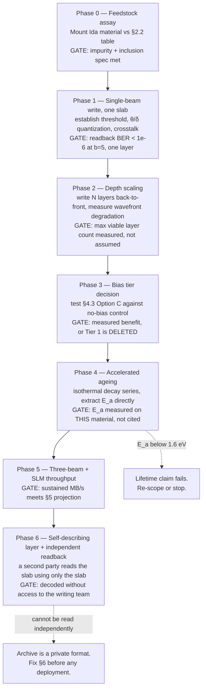

# 5D Optical Holographic Archival Storage in Fused Silica

**R.W. Yett** · ORCID [0009-0001-1303-7190](https://orcid.org/0009-0001-1303-7190) · Arkansas
**Document type:** engineering specification (design study)
**Date:** 2026-09-20
**Copied from:** Chyren repo `Research_and_Data/01_Engineering_and_Inventions/QUARTZ_5D_OPTICAL_HOLOGRAPHIC_ARCHIVAL_SPEC.md` (commit ae69cf8d2) on 2026-10-03, with two edits: the fused product is named *fused quartz*, because it is melted from natural quartz rather than made synthetically, and the 120° beam geometry is credited to the alternate-face layout instead of a misstated C₃ᵥ symmetry.

---

## 0. Epistemic status — read before quoting any number

Nothing in this document has been built. No voxel has been written, no slab
has been read back, no lifetime has been measured. This is a design study, and
its numbers divide into four classes:

| Tier | Meaning | Use |
|---|---|---|
| `[C]` | Cited — a measured constant or a published result from the literature | Quotable with its citation |
| `[D]` | Derived — follows from `[C]` values by arithmetic shown in this document | Quotable with its derivation |
| `[conj]` | Conjectured — a proposed mechanism with no experimental support here | Not quotable as fact |
| `[O]` | Open — a named question this specification does not answer | A work item |

**Three claims circulating in the source notes for this program do not survive
derivation, and are corrected in place below.** They are flagged `⚠ CORRECTION`
where they appear. A summary sits in §9. This is the most important section of
the document; a reader who takes only one thing should take that table.

This specification is **not** a deployment plan, a procurement document, or a
readiness assessment. The build sequence in §8 begins with a single slab and a
readback test, and every later phase is gated on measured results from the one
before it.

---

## 1. Scope and the object being specified

A **deep-time archival medium**: a passive, power-free, machine-readable solid
that holds civic, scientific and cultural records on a timescale where every
active storage technology has failed several times over.

The distinction that motivates the whole program:

```
        DATA CENTER  D = (M, S, E_retention, H)          COMPUTE CENTER  C = (U, grad-L, P_diss, T_grad)
        ------------------------------------             ---------------------------------------------
        objective: hold state unchanged                  objective: transform state
        energy profile: recurring, forever               energy profile: recurring, while working
        failure mode: silent bit rot, format loss        failure mode: throughput collapse
        time constant: as long as the institution        time constant: as long as the job
```

Contemporary "cloud storage" is a *compute center wearing a data center's name*:
it holds state only by continuously spending energy to refresh, replicate and
migrate it. Its retention is a **subscription**, not a **property of the medium**.
The archival substrate specified here moves retention out of the operating
budget and into the physics of the material. §7 gives the energy arithmetic that
makes this a quantitative claim rather than a rhetorical one.

**Target users** (stated as design drivers, not as commitments from any of them):
national and state archives, legislative and judicial record custodians,
genetic and biodiversity ledgers, and cultural-heritage collections — cases
where the retention requirement is measured in centuries and the institution
outlives every vendor it will ever contract with.

---

## 2. Substrate selection — and the first correction

### 2.1 ⚠ CORRECTION: the written substrate must be amorphous, not crystalline

The source material for this program specifies writing 5D voxels into
**hexagonal α-SiO₂** — crystalline quartz — and separately claims thermal
stability to **1000 °C**. These two specifications are mutually exclusive, and
the crystalline choice independently destroys the readout channel. Both
failures are quantitative.

**Failure 1 — intrinsic birefringence swamps the signal.**
α-quartz is a positive uniaxial crystal. At the sodium D line `[C]`:

```
  n_o = 1.54424        n_e = 1.55335        Δn = n_e − n_o = +0.00911
```

The 5D scheme encodes one of its five dimensions as an *induced* retardance
from a written nanograting, of order 30–50 nm `[C]`. Propagating 2 cm through
the crystal at a general angle accumulates an intrinsic optical path difference
of `[D]`:

```
  OPD = Δn · L = 0.00911 × 0.0200 m = 1.822 × 10⁻⁴ m = 182.2 µm ≈ 309 waves at 589.3 nm

  signal / intrinsic  =  40 nm / 182.2 µm  =  2.2 × 10⁻⁴
```

The quantity being measured is four orders of magnitude below the quantity
being measured *through*. Recovering it means holding a 309-wave static
retardance stable to better than one part in 10⁴ across the whole slab, across
temperature, for the life of the archive. That is not a readout margin; it is
an interferometer.

Propagating strictly along the optic axis sets `Δn → 0` for normal incidence,
but α-quartz is also **optically active**, rotating linear polarization by
21.72 °/mm at 589.3 nm `[C]`:

```
  ρ · L = 21.72 °/mm × 20 mm = 434°   (≡ 74° mod 180°)
```

That rotation is deterministic and therefore calibratable, and its thermal
drift is tolerable — `dρ/dT ≈ 1.1 × 10⁻⁴ per °C` relative `[C]` gives only
0.48° of drift over a 10 °C excursion `[D]`, against a 22.5° spacing for
8 quantized orientation levels. But it is strongly dispersive (`ρ ∝ λ⁻²`
approximately), so it pins the readout to a wavelength-stabilized source and
forbids the broadband, instrument-agnostic readback that a *deep-time* archive
most needs. An archive that can only be read by a laser locked to the
frequency its writers used is an archive with a hidden dependency.

**Failure 2 — the α→β transition is at 573 °C, not 1000 °C.**
α-quartz undergoes a displacive phase transition to β-quartz at **573 °C** `[C]`,
with an abrupt volume change that fractures bulk single crystals. The "1000 °C"
figure in circulation is a **fused-silica** number, and it is correct *for fused
silica* — an amorphous solid with no such transition, annealing near 1100 °C and
softening near 1600 °C `[C]`. The thermal claim and the crystalline-substrate
claim cannot both be kept. The thermal claim is the one worth keeping.

### 2.2 The resolution — Arkansas quartz enters as feedstock, not as substrate

This correction costs the program nothing it actually wanted, because the
regional supply-chain thesis survives intact under one substitution:

```
   Mount Ida / Montgomery County, AR          high-purity hydrothermal quartz
   hydrothermal seed stock, lascas       ──▶  feedstock: crushed, acid-leached, graded
              [C: deposit exists]                        │
                                                         ▼
                                              fusion / boule growth  (electric or flame)
                                                         │
                                                         ▼
                                              ► FUSED QUARTZ (fused silica) ◄  ← the written substrate
                                                 amorphous, Δn ≈ 0, no phase transition
```

This is how the high-purity quartz supply chain already works: the mineral is
a **precursor**, melted and re-formed into an amorphous optical solid. The
Arkansas deposit's role — a regional, domestically-sourced input to a strategic
material — is unchanged and arguably strengthened, because feedstock grading is
a volume business where a deposit's purity is the whole value proposition, while
single-crystal optical boules are not what this deposit is best suited to supply.

**Required feedstock grade** (targets, not yet assayed against Mount Ida material — `[O]`):

| Parameter | Target | Rationale |
|---|---|---|
| Total metallic impurity (Al, Na, K, Li, Fe, Ti) | ≤ 20 ppm-wt | Alkali mobility drives long-term defect migration |
| Al specifically | ≤ 10 ppm-wt | Al–alkali centres are the dominant radiation-sensitive defect |
| OH content | specified per §4.3, **not** minimized by default | Sets the bias-tier absorption; see the correction there |
| Fluid inclusions | ≤ 1 per cm³ above 10 µm | Inclusions rupture on fusion and seed bubbles |
| Bubble / inclusion content after fusion | ≤ 0.1 mm⁻³ above 50 µm | Each is a permanent dead region and a scatter source |
| Striae / index homogeneity | Δn ≤ 2 × 10⁻⁶ over the write volume | Wavefront error degrades focal confinement at depth |

### 2.3 Substrate mechanical and optical specification

| Property | Value | Tier |
|---|---|---|
| Material | Amorphous SiO₂ — fused quartz, melted from natural quartz feedstock | — |
| Density | 2.20 × 10³ kg·m⁻³ | `[C]` |
| Mohs hardness | 5.5–6.5 | `[C]` |
| Transmission window | ~185 nm to ~2.5 µm | `[C]` |
| Bandgap E_g | ≈ 9.0 eV | `[C]` |
| Thermal expansion α | 5.5 × 10⁻⁷ K⁻¹ (20–320 °C) | `[C]` |
| Annealing point | ≈ 1100 °C | `[C]` |
| Softening point | ≈ 1600 °C | `[C]` |
| Phase transition in service range | none | `[C]` |
| Nominal slab | 100.0 × 100.0 × 20.0 mm | design choice |
| Slab flatness (written faces) | ≤ λ/4 at 633 nm over any 25 mm aperture | design choice |
| Parallelism, opposed faces | ≤ 10 arcsec | design choice |
| Surface roughness, optical faces | ≤ 1.0 nm RMS | design choice |
| Edge chamfer | 0.5 mm × 45° ± 0.1 mm | handling |

---

## 3. The 5D encoding and its readout

Each voxel carries five independent coordinates. Three are position; two are
written into the birefringence of a self-organized nanograting `[C]`:

```
   (x, y, z)   spatial address, set by the focusing optics
    θ          slow-axis azimuth  — set by the write polarization
    δ          retardance         — set by deposited pulse energy / pulse count
```

The written nanograting is form-birefringent: a sub-wavelength lamellar
structure of alternating densified and rarefied silica whose optic axis lies
along a direction fixed by the writing beam's polarization `[C]`. Readout is a
polarimetric measurement of the Jones matrix of the voxel:

```
    J_voxel = R(−θ) · diag( e^{+iδ/2},  e^{−iδ/2} ) · R(θ)

                       ⎡ cos θ   −sin θ ⎤
    with        R(θ) = ⎢                ⎥
                       ⎣ sin θ    cos θ ⎦
```

Both `θ` and `δ` are recovered from a four-channel Stokes measurement per voxel.
Quantizing `θ` into `N_θ` levels over the 180° ambiguity range and `δ` into
`N_δ` levels gives

```
    b = log₂( N_θ · N_δ )   bits per voxel
```

### 3.1 ⚠ CORRECTION: capacity — 360 TB per slab is an aggressive-regime figure

The circulating figure is **360 TB per 10 × 10 × 2 cm slab**. It is reachable,
but only in a parameter regime well beyond what has been demonstrated, and it is
14× the figure that demonstrated parameters give for the same geometry. The
capacity model is elementary `[D]`:

```
    C  =  (L_x / p_xy) · (L_y / p_xy) · (L_z / p_z) · b   bits
```

with `p_xy` the lateral voxel pitch and `p_z` the layer pitch. For
`L = 100 × 100 × 20 mm`:

| Operating point | p_xy | p_z | N_θ × N_δ | b | Voxels | Capacity | Tier |
|---|---|---|---|---|---|---|---|
| **Demonstrated** | 1.0 µm | 5.0 µm | 8 × 4 | 5 | 4.0 × 10¹³ | **25.0 TB** | `[D]` from `[C]` params |
| **Aggressive** | 0.5 µm | 2.0 µm | 8 × 8 | 6 | 4.0 × 10¹⁴ | **300 TB** | `[conj]` |
| *To reach 360 TB at b = 5* | — | — | — | 5 | 5.76 × 10¹⁴ | 360 TB | requires **0.70 µm isotropic pitch** `[D]` |

The binding difficulty is **axial**, not lateral. A 0.5 µm lateral pitch is
within reach of high-NA focusing at 515 nm; a 2.0 µm layer pitch is not a focusing
problem but a *crosstalk* problem, because the focal volume is elongated along
the optical axis by roughly the ratio `n/NA`, and written layers perturb the
wavefront for every layer written behind them. **The 360 TB figure should be
carried as an aggressive-regime target at `[conj]`, and 25 TB as the
demonstrated-parameter baseline at `[D]`.** Quoting 360 TB as a property of the
medium is not supportable from the published parameters.

`[O]` **Open:** the maximum layer count before accumulated wavefront error from
previously-written layers degrades focal confinement below the writing
threshold. This sets `L_z`, and it has not been measured here. Writing
back-to-front (deepest layer first) is the standard mitigation and is assumed
in §4 but not validated.

### 3.2 ⚠ CORRECTION: lifetime — 13.8 Gyr is the elevated-temperature figure

The source material quotes "> 13.8 × 10⁹ years" and ">10¹⁰ years" as
room-temperature lifetimes. **13.8 Gyr is the published figure at 190 °C**, not at
room temperature `[C]`. The room-temperature extrapolation is a different — and
far larger — number, obtained by Arrhenius scaling of the thermal decay of the
written birefringence:

```
    τ(T) = τ₀ · exp( E_a / k_B T )

    τ(293 K)              ⎡ E_a ⎛  1        1   ⎞ ⎤
    ──────────  =   exp   ⎢ ─── ⎜ ───  −  ───── ⎟ ⎥
    τ(463 K)              ⎣ k_B ⎝ 293      463   ⎠ ⎦
```

| E_a | τ(293 K) / τ(463 K) | τ(293 K) from 13.8 Gyr at 190 °C |
|---|---|---|
| 1.6 eV | 1.25 × 10¹⁰ | 1.7 × 10²⁰ yr |
| 1.7 eV | 5.34 × 10¹⁰ | 7.4 × 10²⁰ yr |
| 1.8 eV | 2.28 × 10¹¹ | 3.2 × 10²¹ yr |

So the honest room-temperature statement is **10²⁰–10²¹ years, extrapolated**,
and the honest 190 °C statement is 13.8 Gyr. Both are `[C]`-sourced
extrapolations, and both should be stated *with their temperature attached* —
a lifetime without a temperature is not a specification.

**The epistemic weak point is the extrapolation itself, not the arithmetic.**
The measurement is an accelerated-decay experiment spanning hours to months at
elevated temperature; the claim spans 10²⁰ years. That is an extrapolation of
roughly twenty orders of magnitude in time, and it is valid only if a single
Arrhenius process with a temperature-independent `E_a` dominates over the entire
range. It assumes away: radiation damage, slow structural relaxation of the
glass below its fictive temperature, mechanical creep, and every failure mode
that is not thermally-activated erasure of the nanograting.

**For a deep-time archive the operative lifetime is not the medium's. It is the
shortest of:** medium decay, container integrity, the readout instrument's
reproducibility, and the survival of the *decoding convention*. §6 addresses the
last of these, which is the one no amount of materials science can fix.

---

## 4. Write architecture — the tri-beam face matrix

### 4.1 Geometry

The slab is addressed by three beam paths at 120° in the write plane, entering
through alternating prepared faces. The 120° spacing is inherited from the
alternate-face layout on a quartz crystal's six-sided prism; in an amorphous substrate it carries
no crystallographic meaning and is retained purely because it is the
symmetric three-way split of the plane, which equalizes the optical path
budget and the thermal load across three independently-controlled channels.

```
                            FACE A  (beam 1, θ-write)
                         ╔══════════════════════════╗
                         ║   ·  ·  ·  ·  ·  ·  ·    ║
              ╱          ║  ·  ·  ·  ·  ·  ·  ·  ·  ║          ╲
     FACE C  ╱           ║   ·  ·  · [VOXEL] ·  ·   ║           ╲  FACE B
   (beam 3) ╱            ║  ·  ·  ·  ·  ·  ·  ·  ·  ║            ╲ (beam 2)
            ╲            ║   ·  ·  ·  ·  ·  ·  ·    ║            ╱
             ╲           ╚══════════════════════════╝           ╱
              ╲                  120° apart                    ╱
                       (registration to a common origin
                        better than one lateral pitch)
```

**Tolerance — inter-beam registration.** All three paths must address a common
voxel lattice. Registration error directly consumes lateral pitch budget:

| Parameter | Tolerance | Basis |
|---|---|---|
| Inter-beam lateral registration | ≤ 0.1 × p_xy (50 nm at p_xy = 0.5 µm) | keeps crosstalk below one quantization step |
| Inter-beam axial registration | ≤ 0.2 × p_z (400 nm at p_z = 2.0 µm) | layer identity |
| Stage positional repeatability | ≤ 25 nm, 3σ, all axes | half the registration budget |
| Face angular alignment | ≤ 20 arcsec | refraction at entry maps angle to lateral walk |
| Thermal stability during a write run | ≤ ±0.1 °C | 100 mm × 5.5 × 10⁻⁷ K⁻¹ × 0.1 K = 5.5 nm |

That last row is the one that constrains the building, not the laser: holding a
100 mm silica slab to a 50 nm registration budget means holding it to a tenth of
a degree, because the substrate's own expansion consumes 5.5 nm per 0.1 °C `[D]`.

### 4.2 The dual-tier energy scheme

The intent is to separate *where energy is deposited* from *where material is
modified*, so that the write threshold can be crossed at the focus without the
peak intensity anywhere else in the beam path approaching the damage threshold.
Tier 1 (bias) raises the substrate toward the modification threshold across the
addressed region; Tier 2 (write) crosses it only within the femtosecond focal
volume.

```
   ┌──────────────────────────────────────────────────────────────────┐
   │  TIER 1 — BIAS          volumetric, sub-threshold, slow          │
   │     raises local state toward the modification threshold         │
   │     ⚠ see §4.3: the specified 1064 nm CW source cannot do this   │
   ├──────────────────────────────────────────────────────────────────┤
   │  TIER 2 — WRITE         150–250 fs, focal-volume-confined        │
   │     crosses the threshold only inside the focus; sets θ and δ    │
   │     θ ← write polarization azimuth                               │
   │     δ ← deposited energy (pulse energy × pulse count)            │
   └──────────────────────────────────────────────────────────────────┘
```

The ionization physics setting Tier 2 `[C]`:

| Write λ | Photon energy | Multiphoton order for E_g = 9.0 eV | Critical plasma density N_c |
|---|---|---|---|
| 1030 nm | 1.204 eV | 8 | 1.05 × 10²¹ cm⁻³ |
| 515 nm | 2.408 eV | 4 | 4.20 × 10²¹ cm⁻³ |

with `N_c = ε₀ m_e ω² / e²` `[D]`. **515 nm is the preferred write wavelength**:
halving the multiphoton order from 8 to 4 collapses the intensity required to
seed the process, and the tighter focus improves both lateral pitch and axial
confinement — the parameter §3.1 identified as binding.

`[conj]` The source material proposes avalanche onset at `N_e ≈ 10¹⁸ cm⁻³`. That
is ~10³ below the critical density at which *optical breakdown* occurs, which is
consistent rather than contradictory: nanograting formation is a **sub-breakdown**
process, and 10¹⁸ cm⁻³ is a plausible order for the defect-mediated regime where
self-trapped excitons drive structural reorganization without catastrophic
damage. It is carried here at `[conj]` — it is a reasonable figure, not a
measured one, and the distinction between the nanograting regime and the
breakdown regime is the single most important parameter to establish
experimentally (§8, Phase 1).

### 4.3 ⚠ CORRECTION: the 1064 nm CW bias tier deposits no usable energy

The specified Tier-1 source is a **continuous-wave 1064 nm** beam. Fused silica
is transparent at 1064 nm — that transparency is the entire reason it is the
substrate. Taking a generous bulk attenuation of `α ≈ 10⁻⁴ cm⁻¹` `[C]`, the
absorbed fraction over the full 2 cm path is `[D]`:

```
    1 − exp(−α L) = 1 − exp(−10⁻⁴ × 2.0) = 2.0 × 10⁻⁴   (0.020 %)
```

A 10 W CW beam therefore deposits **2.0 mW** spread over the entire path — not
in the focal volume, over the *whole 2 cm*. This cannot bias anything. The
mechanism as specified does not function, and the reason is structural: any
wavelength at which the substrate is a good archival window is a wavelength at
which a CW beam passes through it without interacting.

Three candidate repairs, none yet tested:

| Option | Mechanism | Assessment | Tier |
|---|---|---|---|
| **A — 10.6 µm CO₂** | Multiphonon absorption; silica is strongly absorbing | Absorption depth 10–20 µm ⇒ **surface-only**. Cannot bias a bulk volume. Rejected for volumetric use. | `[D]` |
| **B — defect-resonant bias** | Pump an existing colour-centre band (e.g. NBOHC ≈ 620 nm) | Requires a pre-existing defect population — i.e. a pre-damaged substrate. Self-defeating for an archival medium. | `[conj]` |
| **C — OH-overtone bias, 2.7–2.9 µm** | The OH fundamental near 2.73 µm; absorption tunable by OH loading during fusion | **The only volumetric and tunable option.** Absorption depth is a manufacturing parameter, set at the boule. | `[O]` |

**Option C is the recommended direction**, and it is why §2.2's feedstock table
declines to minimize OH by default: OH content becomes a *designed* parameter
rather than a contaminant. The cost is unquantified — OH loading plausibly
affects nanograting formation, thermal stability, and the decay activation
energy `E_a` that §3.2's entire lifetime claim rests on. **This is the largest
open item in the specification.** Raising `[O]` here rather than picking a number
is deliberate.

`[O]` Whether a bias tier is needed at all. Published 5D writing uses a single
femtosecond beam with no bias. The two-tier scheme's claimed benefit — avoiding
thermal-shock microcracking by lowering the peak energy needed at the focus —
is plausible but unquantified, and if the single-beam process is adequate, Tier 1
should be removed rather than repaired. Phase 1 (§8) tests exactly this.

### 4.4 Electro-thermal poling — carried at [conj]

The source material proposes electro-thermal poling at **10–30 kV·cm⁻¹, 150–250 °C**,
and attributes to it a **Poole–Frenkel lowering of the effective bandgap by
1–2 eV**. Thermal poling of silica is real and well-documented `[C]`: it induces a
frozen-in space-charge field and a second-order optical nonlinearity in a thin
sub-surface layer.

The **1–2 eV bandgap-lowering claim is `[conj]` and quantitatively unsupportable.**
The Poole–Frenkel barrier lowering is

```
    ΔΦ = √( e³E / πε₀ε_r )
```

which over the specified field range, with ε_r ≈ 3.8 for silica, gives `[D]`:

| Applied field | ΔΦ |
|---|---|
| 10 kV·cm⁻¹ = 1.0 × 10⁶ V·m⁻¹ | **0.039 eV** |
| 30 kV·cm⁻¹ = 3.0 × 10⁶ V·m⁻¹ | **0.067 eV** |

That is a shortfall of **15× to 51×** against the claimed 1–2 eV — between 1.2 and
1.7 orders of magnitude. Running the relation backwards, reaching a 1 eV lowering
would require `[D]`:

```
    E = ΔΦ² · πε₀ε_r / e³ = 6.6 × 10⁸ V·m⁻¹ = 660 MV·m⁻¹
```

against a fused-silica dielectric strength of 25–40 MV·m⁻¹ `[C]` — **a factor of
~19 above breakdown.** The field required to produce the claimed effect destroys
the substrate first. The claim as stated is not supportable; if poling helps the
write process, the mechanism is something other than Poole–Frenkel barrier
lowering. Carried at `[conj]` pending a mechanism, and **not** relied on anywhere
else in this specification.

---

## 5. Write throughput — the actual binding constraint

Capacity and lifetime attract the attention. Neither is the limiting engineering
problem. **Throughput is**, and it is the real justification for a multi-beam
architecture — a much stronger justification than the symmetry argument in §4.1.

At one pulse per voxel, writing the 4.0 × 10¹⁴ voxels of the aggressive operating
point `[D]`:

| Configuration | Wall-clock to fill one 300 TB slab |
|---|---|
| 1 beam @ 1 MHz | 4.00 × 10⁸ s = **12.7 years** |
| 1 beam @ 10 MHz | 4.00 × 10⁷ s = **1.27 years** |
| **3 beams @ 10 MHz** | 1.33 × 10⁷ s = **154 days** |
| 3 beams @ 10 MHz, 100-focus SLM multiplexing | **1.5 days** |

Sustained data rate for the three-beam configuration: **22.5 MB·s⁻¹** `[D]`.
With 100-way spatial-light-modulator multiplexing: **2.25 GB·s⁻¹** `[D]`.

Even three beams at 10 MHz leave a five-month write time per slab. **Parallel
focus multiplexing is not an optimization; it is a requirement for any
throughput that an archive can actually use.** A specification that lists three
beams and omits the SLM has not addressed the problem.

Write energy budget `[D]`: 4.0 × 10¹⁴ pulses × 200 nJ = **8.0 × 10⁷ J = 22.2 kWh**
for the full 300 TB slab, a mean delivered optical power of 6.0 W. Even at a
5 % wall-plug efficiency for the femtosecond amplifier chain, the total write
energy is of order 450 kWh — the point being that the write is *cheap*, and
§7 turns that into the commercial argument.

`[O]` Multi-pulse voxels. If the retardance `δ` requires pulse accumulation
rather than single-pulse energy control, every number in this section
multiplies by the pulse count. This is the difference between a five-month
write and a five-year one, and it is unresolved.

---

## 6. Readout, and the problem materials science cannot solve

```
   ┌────────────┐   ┌──────────┐   ┌───────────┐   ┌────────────┐   ┌──────────┐
   │ stabilized │──▶│ polarizer│──▶│   SLAB    │──▶│  rotating  │──▶│  camera  │
   │   source   │   │  (fixed) │   │  (x,y,z)  │   │  analyser  │   │  array   │
   └────────────┘   └──────────┘   └───────────┘   └────────────┘   └──────────┘
                                         │                                │
                                         │      four-channel Stokes       ▼
                                         └──────────────────────▶  (θ, δ) per voxel
                                                                         │
                                                                         ▼
                                                                 demodulation ──▶ bits
```

Readout is passive and non-destructive: it measures polarization state, deposits
no energy near the modification threshold, and can in principle be repeated
without limit `[C]`.

**The decoding-convention problem.** A medium with a 10²⁰-year decay constant
whose bits are meaningless without a codebook has an *effective* lifetime equal
to the codebook's survival. This is the dominant risk in the whole program, and
it is an institutional problem wearing a technical disguise.

Mitigation, in order of decreasing reliance on continuity:

1. **Self-describing outer layer.** The outermost written layer carries the
   decoding specification in a progressively-decodable form — a visual
   alignment fiducial legible under an ordinary microscope, then a bitmap
   glyph table, then the codebook in plain text, then the payload. Each stage
   is readable using only what the previous stage taught the reader.
2. **Clear-text default.** No encryption and no compression on Tier I civic and
   historical records. Any cipher is a dependency on key survival; any
   compression is a dependency on an algorithm's survival. Both convert a
   physics-limited lifetime into an institution-limited one.
3. **Redundancy across sites,** not just within a slab. Erasure coding within a
   slab protects against local voxel loss; it does nothing against loss of the
   slab.
4. **Physical legibility of the container,** including the material's identity,
   the readout principle, and the wavelength dependence of §2.1 — etched
   macroscopically on the container, not written in the medium it explains.

---

## 7. The commercial case, as arithmetic

The pivot is from **recurring retention cost** to **one-time write cost**.

**Both sides must be measured at the wall**, or the comparison is not a
comparison. §5's 22.2 kWh is *delivered optical* energy; the storage figures
below are wall-plug, including cooling, power conversion and redundancy. Taking
a 5 % wall-plug efficiency for the femtosecond amplifier chain `[C]`, the write
side at the wall is `[D]`:

```
    E_wall = 22.2 kWh / 0.05 = 444 kWh   per 300 TB slab, written once
```

Against conventional spinning-disk storage (stated assumption: effective
1 W·TB⁻¹ at the wall — a conservative figure; the sensitivity is shown) `[D]`:

| Storage power | Annual energy, 300 TB | Quartz write (444 kWh) breaks even in | 100-year energy ratio |
|---|---|---|---|
| 0.5 W·TB⁻¹ | 1,314 kWh·yr⁻¹ | 123 days | 296 : 1 |
| **1.0 W·TB⁻¹** | **2,628 kWh·yr⁻¹** | **62 days** | **592 : 1** |
| 2.0 W·TB⁻¹ | 5,256 kWh·yr⁻¹ | 31 days | 1,184 : 1 |

**Break-even against the recurring energy cost alone is on the order of
months**, and over a century the ratio is several hundred to one. Comparing
delivered optical energy against wall-plug storage energy would flatter this
result by roughly 20× — it is the same error as quoting a lifetime without its
temperature, and it is avoided here deliberately.

Even at the honest basis the argument holds, and the comparison remains
*generous to the incumbent*: it counts only electricity, and omits the media
refresh cycle (disk replacement every 5–7 years), the migration labour, the
format-obsolescence risk, and the fact that the disk array's retention ends the
moment the invoice does.

**Honest counterweights, none of which the energy ratio addresses:**

- **Write-once.** The medium is not rewritable. It is an archival tier, not
  storage, and it competes with tape and with nothing else.
- **Capital and access cost.** The femtosecond write station and the polarimetric
  reader are capital equipment with no consumer volume behind them. Cost per
  written TB is unknown here and is plausibly the deciding commercial variable —
  not the energy ratio above.
- **Latency.** Retrieval is a laboratory operation measured in hours. Any use
  case needing faster access is not this use case.
- **The 300 TB figure is `[conj]`** (§3.1). At the demonstrated 25 TB the
  per-slab economics change by 12×, though the *energy ratio* — which is
  per-TB on both sides — does not.

---

## 8. Build sequence — one slab before any archive

Each phase is gated on measured results from the previous one. No phase begins
because the previous phase seemed promising.



Phase 6 is the one most likely to be skipped and the one that matters most. An
archive that only its authors can read has not been demonstrated; it has been
asserted. The gate is explicit: **a party with no access to the writing team
decodes the slab using only the slab and its container.**

---

## 9. Correction summary

The three corrections in this document, collected — these are the items where a
figure in circulation does not survive derivation:

| # | Circulating claim | Status | Correct statement | § |
|---|---|---|---|---|
| 1 | Write into hexagonal α-SiO₂ (crystalline), stable to 1000 °C | **Mutually exclusive, and crystalline breaks readout** | α→β transition at 573 °C ends the crystal. 1000 °C is a *fused-silica* figure. Intrinsic Δn = 0.00911 puts the signal 4 orders down (2.2 × 10⁻⁴). **Use amorphous fused silica; Mount Ida quartz is feedstock.** | §2.1–2.2 |
| 2 | 360 TB per 10 × 10 × 2 cm slab | **Aggressive-regime, not demonstrated** | Demonstrated parameters give **25 TB** for that geometry. 360 TB needs 0.70 µm *isotropic* pitch; 300 TB is reachable at 0.5 µm / 2.0 µm / 6 bits. Axial pitch is binding. | §3.1 |
| 3 | Room-temperature lifetime > 13.8 × 10⁹ yr | **Temperature mis-attributed** | 13.8 Gyr is the **190 °C** figure. Room-temperature Arrhenius extrapolation is **10²⁰–10²¹ yr**, depending on E_a ∈ [1.6, 1.8] eV — and is a ~20-order extrapolation in time. | §3.2 |
| 4 | CW 1064 nm bias tier | **Mechanism does not function** | Absorbed fraction 2.0 × 10⁻⁴ over 2 cm; a 10 W beam deposits 2.0 mW total. Volumetric bias requires the OH-overtone route (2.7–2.9 µm), or Tier 1 should be deleted. | §4.3 |
| 5 | Poling lowers the bandgap 1–2 eV (Poole–Frenkel) | **Short by 15–51×** | ΔΦ = √(e³E/πε₀ε_r) gives 0.039–0.067 eV over 10–30 kV·cm⁻¹. Reaching 1 eV needs 660 MV·m⁻¹ — ~19× above the dielectric strength. Thermal poling is real; this mechanism for it is not. | §4.4 |

## 10. Open items

| ID | Item | § |
|---|---|---|
| Q-01 | Mount Ida feedstock has not been assayed against the §2.2 grade table | §2.2 |
| Q-02 | Maximum layer count before wavefront degradation — sets L_z and capacity | §3.1 |
| Q-03 | OH loading as a designed bias-absorption parameter; its effect on E_a is unknown | §4.3 |
| Q-04 | Whether a bias tier is needed at all, against a single-beam control | §4.3 |
| Q-05 | Mechanism for any poling benefit, given §4.4 | §4.4 |
| Q-06 | Pulses per voxel — multiplies every §5 throughput figure | §5 |
| Q-07 | Nanograting-regime vs breakdown-regime carrier density, measured | §4.2 |
| Q-08 | Capital cost per written TB — plausibly the deciding commercial variable | §7 |
| Q-09 | Published 5D writing used optical-grade fused silica. Whether fused quartz melted from natural (Mount Ida) feedstock writes and ages the same way is unmeasured. If only synthetic silica works, the deposit's purity stops mattering for this product, because synthetic silica gets its purity from chemical precursors | §2.2 |

---

*Prepared by R.W. Yett (ORCID 0009-0001-1303-7190), Arkansas, 2026-09-20.
Design study. No hardware has been built and no measurement reported here was
performed by the author; every `[C]` figure is a literature value and every
`[D]` figure is arithmetic on those values, shown in place.*
